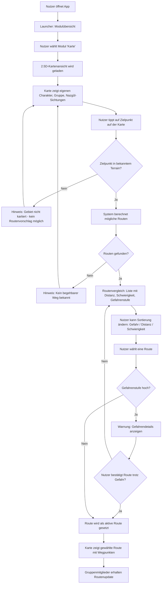

# Artifact 2 - Deciding: Navigation & Orientierung

## System Capability

**Navigation & Orientierung**

Die Gruppe kann auf einer 2.5D-Karte ein Ziel auswählen und erhält daraufhin Routenvorschläge, die anhand von Distanz, Geländeschwierigkeit und zuletzt bekannten Gefahrenpositionen (z.B. Nazgûl-Sichtungen) bewertet werden. Der Nutzer entscheidet sich für eine Route und die Gruppe wird entlang dieser navigiert.

**Warum dieses Feature?**

TODO

## Flow

---

## Wireframe

**File:** 

**Unterstützung von Intent & Value**
Unser Design transformiert den Intent („Unterstützung in einer unbekannten Welt“) in ein geführtes Nutzererlebnis:
- Frühzeitige Gefahrenerkennung: Die Geographie-Ansicht (Screen 2) visualisiert Bedrohungen („Gefahren-Eintrag“) explizit mit Zeitstempeln. Dies unterstützt den Value, Bedrohungen zu erkennen, bevor sie lebensgefährlich werden.
- Informierte Entscheidung: Der Optionen-Vergleich (Screen 3) bündelt komplexe Umweltdaten (Distanz, Schwierigkeit, Gefahr) in einfache Kategorien. Dies befähigt die unerfahrenen Hobbits, Reisezeiten zu minimieren und optimale Routen selbstständig zu identifizieren.
- Sicherheitsbarriere: Die Kategorie-Warnung (Screen 4) stellt sicher, dass riskante Entscheidungen nicht versehentlich getroffen werden. Das unterstützt den zentralen Wert: das Überleben der Gruppe.

**Bewusste Auslassungen (Deliberate Omissions)**
Um die kognitive Belastung für die Hobbits gering zu halten, haben wir Folgendes weggelassen:
- Echtzeit-Tracking von Feinden: Um die Lore-Konsistenz zu wahren, zeigen wir nur „letzte Sichtungen“. Ein Echtzeit-Punkt würde eine falsche Sicherheit suggerieren, die in der Wildnis nicht existiert.
- Automatisches Routing: Die App schlägt keine „beste“ Route vor. Die Entscheidungshoheit bleibt bei der Gruppe, um deren Autonomie und Wachsamkeit zu fördern.
- Detaillierte Menütiefen: Der Launcher beschränkt sich auf vier Kern-Kategorien, um in Stresssituationen keine Zeit durch Suchen zu verlieren (Hick’s Law).

**Annahmen & Constraints (Assumptions & Constraints)**
- Internet-Abhängigkeit: Das Design zeigt im Hauptmenü (Status B) permanent den Verbindungsstatus an, da eine aktive Internetverbindung für die Datenaktualität zwingend erforderlich ist (Constraint aus Assignment 1).
- Manuelle Datenpflege: Wir gehen davon aus, dass die Gruppe „Gefahren-Einträge“ und „Ziel-Einträge“ manuell pflegt oder durch Allianzen erhält, da keine automatische Datenquelle für Mittelerde existiert.
- Struktur vor Ästhetik: Das Design nutzt ein klassisches Spalten-Layout im Vergleich und Kacheln im Menü. Dies folgt Jakob’s Law (Nutzer bevorzugen bekannte Strukturen), was die Lernkurve für die Hobbits minimiert.*

### Screen 1: Launcher

Der Launcher ist das Hauptmenü der Anwendung. Er zeigt die verfügbaren Module als große, klar beschriftete Kacheln an. Für den aktuellen Scope ist nur das Modul **"Karte"** aktiv — die anderen Module (Lexikon, Kommunikation, etc.) sind sichtbar, aber ausgegraut, um den zukünftigen Funktionsumfang anzudeuten, ohne falsche Erwartungen zu wecken.

### Screen 2: Kartenansicht (2.5D)

Die Karte ist der zentrale Screen. Sie zeigt:

- **Eigener Charakter** als Mini-Karikatur im Zentrum der Karte
- **Gruppenmitglieder** als kleinere Karikaturen mit Namen, sofern sie sich in Kartenreichweite befinden
- **Nazgûl-Sichtungen** als rote Markierungen mit Zeitstempel ("Zuletzt gesichtet: vor 2 Stunden"), um die Ungewissheit über die aktuelle Position zu kommunizieren
- **Terrain-Informationen** durch visuelle Unterscheidung (Wald, Gebirge, Fluss, Pfad)

Der Nutzer kann auf einen beliebigen Punkt der Karte tippen, um ihn als **Ziel** zu setzen. Daraufhin öffnet sich der Routenvergleich.

### Screen 3: Routenvergleich

Dieser Screen zeigt die verfügbaren Routen zum gewählten Ziel als Liste, jeweils mit:

- **Geschätzte Distanz** (in Tagesreisen)
- **Geländeschwierigkeit** (leicht / mittel / schwer) basierend auf Terrain
- **Gefahrenstufe** (niedrig / mittel / hoch) basierend auf der Nähe zu zuletzt bekannten Bedrohungen
- **Routenverlauf** als hervorgehobene Linie auf der Karte im Hintergrund

Die Routen sind standardmäßig nach Gefahrenstufe sortiert (sicherste zuerst), weil im Kontext der Reise das Überleben Vorrang vor Geschwindigkeit hat. Der Nutzer kann die Sortierung auf Distanz oder Schwierigkeit umschalten.

Wählt der Nutzer eine Route mit hoher Gefahrenstufe, erscheint eine **Warnung** mit den konkreten Gefahrendetails, bevor die Route bestätigt werden kann.

## Design Rationale

### Bezug zu Artifact 1

Die Capability "Navigation & Orientierung" aus Artifact 1 formuliert drei Teilaspekte: Orientierung, sichere Routen und Standortverfolgung. Dieser Slice fokussiert auf **sichere Routen** und nutzt die Orientierung (Karte) als Vehikel für die Routenwahl. Die Standortverfolgung fließt passiv ein (Positionen der Gruppenmitglieder sind sichtbar), wird aber nicht als eigene Funktion gestaltet.

### Entscheidung: Launcher als Modulübersicht

Der Launcher existiert, weil die Anwendung laut Artifact 1 eine "allgemeine Companion App mit verschiedenen Modulen" sein soll. Eine modulare Einstiegsseite statt eines direkten Kartenstarts hat den Vorteil, dass zukünftige Capabilities (Lexikon, Kommunikation) ohne Umstrukturierung integriert werden können. Der Trade-off ist ein zusätzlicher Tap bis zur Karte — akzeptabel, weil die Routenwahl kein sekundenrelevanter Vorgang ist.

### Entscheidung: 2.5D-Karte statt 2D oder 3D

Eine 2.5D-Darstellung (isometrische Perspektive) bietet gegenüber 2D den Vorteil, Geländeunterschiede (Berge, Täler) intuitiv darzustellen — das ist für die Routenwahl entscheidend, weil die Geländeschwierigkeit ein Bewertungskriterium ist. Volle 3D wurde verworfen, weil sie die Übersichtlichkeit reduziert und höhere technische Komplexität für eine Webanwendung (Constraint aus Artifact 1) mit sich bringt.

### Entscheidung: "Zuletzt gesichtet" statt Echtzeit

Nazgûl-Positionen werden als "zuletzt gesichtet/gespürt" mit Zeitstempel angezeigt, nicht als Echtzeit-Tracking. Das ist eine bewusste Designentscheidung aus zwei Gründen:

1. **Lore-Konsistenz:** Die Hobbits haben keine Möglichkeit, Feinde in Echtzeit zu verfolgen. Die Information kommt aus eigenen Beobachtungen oder Berichten anderer.
2. **Ehrliche Unsicherheit:** Ein Echtzeit-Punkt suggeriert Sicherheit, die nicht existiert. Ein Zeitstempel kommuniziert explizit: "Diese Information ist veraltet — entscheide entsprechend."

### Assumptions

1. **Kartendaten existieren:** Die Karte basiert auf manuell gepflegten Daten (konsistent mit Constraint 3 aus Artifact 1: "Inhalte müssen manuell gepflegt werden"). Routen können nur über bekanntes Terrain berechnet werden — unerforschte Gebiete erscheinen als leere Flächen.
2. **Routenberechnung ist deterministisch:** Das System schlägt Routen basierend auf vorhandenen Pfaden und Terrain vor. Es gibt keine KI-basierte Optimierung — die Entscheidung liegt beim Nutzer.
3. **Gefahrendaten werden extern geliefert:** Die Positionen von Bedrohungen kommen aus der Capability "Gefahrenerkennung". Für diesen Slice nehmen wir an, dass diese Daten vorhanden sind, ohne deren Erfassung zu gestalten.
