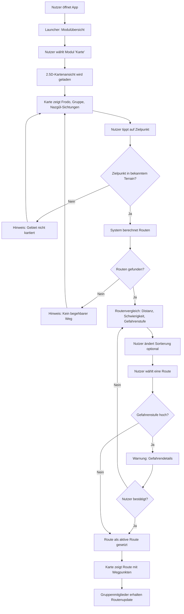

# Artifact 3 — Representation

## Selected System Capability

**Navigation und Orientierung** — Die Gruppe kann auf einer stilisierten 2.5D-Karte ein Ziel auswählen und erhält Routenvorschläge, bewertet nach Distanz, Geländeschwierigkeit und zuletzt bekannten Feindpositionen. Bei hoher Gefahrenstufe erscheint ein Bestätigungs-Dialog, bevor die Route aktiv gesetzt wird.

---

## Implementation

- **Interface:** [`src/interface.html`](src/interface.html)
- **Styles:** [`src/style.css`](src/style.css)
- **Wireframe (Referenz):** [`src/decisions.png`](src/decisions.png)

---

## Design Rationale

### Wie unterstützt dieses Interface die Absicht aus Assignment 1?

Assignment 1 definiert fünf Capabilities und priorisiert **Navigation & Orientierung** als Scope-1-Feature, weil sie foundational für alles andere ist: eine Gruppe, die sich nicht sicher orientieren kann, hat keine Handlungsfähigkeit. Das Interface setzt genau diese Priorität um.

Die zwei Personas aus Assignment 1 spiegeln sich direkt in den UX-Entscheidungen wider:

- **Frodo** (low-tech, Entscheidungsträger) braucht klare Empfehlungen ohne Informationsüberlastung — daher "Empfohlen"-Badge und Gefahren-Sortierung als Standard. Die Routen sind nicht gleichwertig präsentiert; die sicherste Option ist visuell hervorgehoben.
- **Aragorn** (medium-tech, Stratege) würde die Sort-Tabs und Detailkennzahlen nutzen — sie sind vorhanden, aber nicht aufdringlich.

Der Launcher zeigt drei gesperrte Module neben dem aktiven Karten-Modul. Das kommuniziert direkt aus Assignment 1: die App ist eine "allgemeine Companion App mit verschiedenen Modulen" — Navigation ist Schritt eins, nicht das Gesamtprodukt.

### Wie spiegelt es das Wireframe aus Assignment 2?

Das Wireframe aus Assignment 2 zeigt vier Phones nebeneinander: Launcher, Kartenansicht, Routenvergleich, Gefahren-Warnung. Das Interface implementiert genau diese vier Screens, in dieser Reihenfolge, mit dem selben Interaktionsfluss:

| Wireframe (Assignment 2) | Interface (Assignment 3)         |
| ------------------------ | -------------------------------- |
| Phone 1: Hauptmenü, 2×2-Grid, ein aktiver Slot | Screen 1: Launcher, gleiche Grid-Struktur |
| Phone 2: Geographie-Ansicht mit Ankerpunkten | Screen 2: Kartenansicht, isometrische SVG-Karte mit Frodo, Gefährten, Nazgûl-Zonen, Ziel |
| Phone 3: Optionen-Vergleich mit zwei Spalten | Screen 3: Routenvergleich als Liste mit 3 Karten, Gefahren-Balken, Sort-Tabs |
| Phone 4: Kategorie-Warnung als Overlay | Screen 4: Warning-Sheet von unten über gedimmtem Screen 3 |

Die Annotation "Option-Größe (Fitt's)" im Wireframe für Screen 1 ist explizit umgesetzt: die Modul-Kacheln sind `min-height: 148px`, großflächig tippbar. Die "Zurück"-Navigation und der Fortschrittsbalken für Gefahrenstufe aus dem Wireframe finden sich ebenfalls im Interface.

### Was wurde bewusst nicht implementiert?

- **Echter Tap auf die Karte:** Im Wireframe-Flow tippt der Nutzer auf einen Punkt der Karte, um ein Ziel zu setzen. Das ist nicht interaktiv — die Karte ist ein statisches SVG. Der "Routen berechnen"-Button springt direkt zum Routenvergleich. Ein interaktiver Zielpunkt würde JavaScript-Canvas oder eine Map-Library erfordern, was den Scope überschreitet.
- **Echte Sortierung:** Die Sort-Tabs wechseln visuell den aktiven Zustand, ordnen die Routenkarten aber nicht um. Die tatsächliche Sortierlogik ist als UI-Zustand angedeutet, nicht implementiert.
- **Gruppen-Update nach Routenwahl:** Flow-Schritt T im Mermaid-Diagram ("Gruppenmitglieder erhalten Routenupdate") hat keinen eigenen Screen — das setzt Netzwerk/Kommunikations-Infrastruktur voraus, die explizit außerhalb dieses Slices liegt.
- **Edge Cases:** Die Flows für "Gebiet nicht kartiert" und "kein begehbarer Weg bekannt" sind im Flussdiagramm modelliert, aber nicht als eigene Screens implementiert.

### Welche Assumptions und Constraints haben die Entscheidungen geprägt?

**Constraint: Webanwendung ohne Backend (Assignment 1, Constraint 2)**
Alle Screens sind statisches HTML/CSS mit minimalem JavaScript für Navigation. Keine API-Calls, keine Datenbankanbindung. Das begrenzt die Interaktivität der Karte und macht die Routenliste statisch.

**Assumption: Kartendaten und Gefahrendaten sind vorhanden**
Die Karte zeigt fest kodierte Positionen (Frodo, Gefährten, Nazgûl-Sichtungen, Bree als Ziel). Im echten System kämen diese aus manuell gepflegten Datenquellen (Assignment 1, Constraint 3) und der Capability "Gefahrenerkennung".

**Constraint: Mobile-First**
Das Layout ist auf `max-width: 430px` ausgelegt. Auf Desktop erscheint die App als abgerundetes Phone-Frame. Alle Tap-Targets sind nach Fitts' Law dimensioniert — besonders relevant, weil die Nutzungssituation (unterwegs, unter Stress) präzise Interaktion schwierig macht.

**Entscheidung: "Zuletzt gesichtet" statt Echtzeit**
Nazgûl-Positionen zeigen Zeitstempel ("vor 2h"), keine Live-Position. Das ist lore-konsistent (Hobbits haben kein Echtzeit-Tracking) und interface-ehrlich: ein blinkender Punkt ohne Zeitstempel würde Sicherheit suggerieren, die nicht existiert.

**Entscheidung: Warning als Bottom Sheet, nicht eigene Seite**
Screen 4 ist ein Bottom Sheet über einem gedimmten Echo von Screen 3. Der Kontext bleibt sichtbar — der Nutzer sieht noch, welche Route er gewählt hat. Die zwei gleichwertigen Buttons (50/50-Grid, kein Primär/Sekundär) geben die Entscheidungsverantwortung an den Nutzer zurück.

---

## Flow

---

## Screen-Beschreibungen

### Screen 1 — Launcher

Einstiegspunkt der App. 2×2-Grid mit vier Modul-Kacheln. Nur "Karte & Navigation" ist aktiv; die anderen drei (Gefahrenerkennung, Gruppenkoordination, Lexikon) sind ausgegraut und als "Bald verfügbar" markiert. Das kommuniziert den geplanten Umfang der App ohne falsche Erwartungen. Fitts'-Law-Dimensionierung: jede Kachel ist `148px` hoch für sichere Tap-Targets.

### Screen 2 — Kartenansicht

Isometrische SVG-Karte mit Perspektivgitter. Frodo als goldener Puls-Marker, Gefährten als blaue Kreise, Nazgûl-Sichtungen als blinkende rote Zonen mit Zeitstempel ("vor 2h"), Bree als Ziel-Marker. Alert-Leiste am unteren Rand, darüber ein prominenter CTA-Button "Routen berechnen → Ziel: Bree".

### Screen 3 — Routenvergleich

Drei Routenkarten, standardmäßig nach Gefahrenstufe sortiert (sicherste zuerst). Jede Karte zeigt Distanz, Geländeschwierigkeit und Gefahrenstufe mit Farbbalken. Die empfohlene Route hat ein grünes Badge; die Nebelmoor-Route ein rotes "Hohe Gefahr"-Badge und roten Kartenrahmen. Sort-Tabs zum Umschalten der Sortierung.

### Screen 4 — Gefahren-Warnung

Bottom Sheet über gedimmtem Screen 3. Roter Warn-Icon mit Glow-Effekt, drei Gefahrendetails (Sichtungen, Zeitstempel, Terrain), zwei gleichwertige Buttons: "← Andere Route" und "Trotzdem nehmen". Das Sheet animiert von unten herein (`slideUp`).
