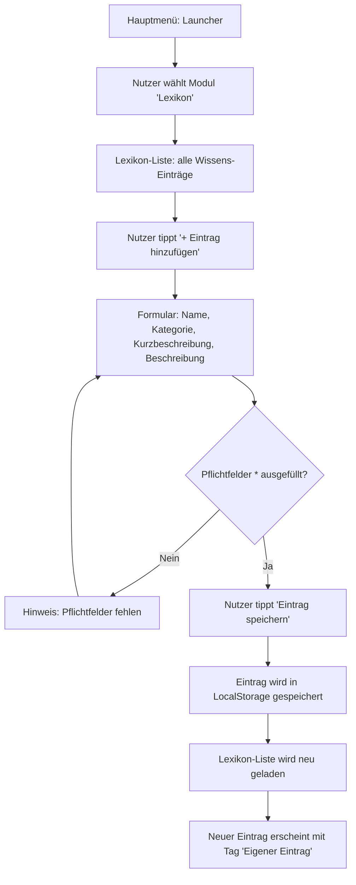

**Lesart:** Der Flow zeigt den vollständigen Weg eines Nutzers vom Hauptmenü bis zum selbst angelegten Lexikon-Eintrag — den einzigen Schreibzugriff im gesamten System. Die einzige Verzweigung ist die Formularvalidierung (Name + Beschreibung sind mit * markierte Pflichtfelder); bei fehlenden Angaben bekommt der Nutzer erst einen Hinweis, statt direkt und ohne Feedback ins Formular zurückgeschickt zu werden. Nach dem Speichern landet der Nutzer wieder auf der Lexikon-Liste, in der der neue Eintrag dank "Eigener Eintrag"-Tag von den mitgelieferten Einträgen unterscheidbar ist.
