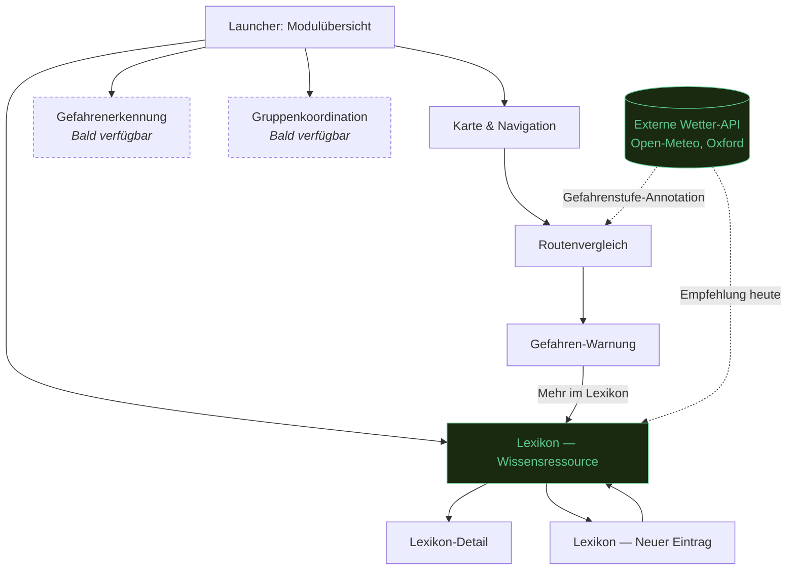

**Lesart:** Vier Module hängen am Launcher als gemeinsamem Einstiegspunkt. Navigation und Lexikon sind implementiert (Artifact 5), Gefahrenerkennung und Gruppenkoordination bleiben angekündigte, noch nicht gebaute Module (gestrichelt). Die Gefahren-Warnung — Teil der Navigation — verweist gezielt in das Lexikon, statt die beiden Capabilities isoliert zu lassen. Innerhalb des Lexikons führt der Eintrag "Neuer Eintrag" zurück in die Lexikon-Liste, nicht zu einem neuen Modul — er ist eine Erweiterung der bestehenden Capability, kein eigener Knoten. Die externe Wetter-API ist kein eigenes Modul, sondern ein Signal, das in zwei bestehende Capabilities einspeist (Routenanzeige, Lexikon-Empfehlung) — dargestellt als externer Knoten mit gepunkteten Einfluss-Kanten statt einer eigenen Navigationskante.
